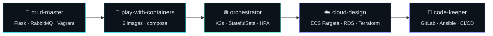

<div align="center">



<br/>

<a href="https://alasmawi.dev">
  
</a>
<a href="mailto:alasmawiabdulla0@gmail.com">
  
</a>
<a href="https://github.com/Alasmawi?tab=followers">
  
</a>


<br/><br/>


</div>

---

```console
➜  ~ whoami --verbose
```

I write software end to end, then I write the infrastructure that runs it.

Most of my repos come in pairs: an application, and the pipeline, cluster or hardened box that actually puts it in front of users. I like the part of the job where a working prototype has to survive a deployment.

```jsonc
{
  "name":      "Abdulla Alasmawi",
  "alias":     "Yi",
  "location":  "Kingdom of Bahrain",
  "degree":    "BSc Computer Science — Cloud Computing, University of Bahrain",
  "training":  "Reboot01 / 01Edu — Cloud DevOps specialization",
  "languages": ["Go", "Rust", "Python", "JavaScript", "Shell", "HCL"],
  "studying":  "AWS Solutions Architect Associate (SAA-C03)",
  "speaks":    ["العربية", "English"],
  "site":      "https://alasmawi.dev"
}
```

---

## 🧭 One backend, five ways to ship it

A single microservices backend, deployed five different ways — each repo is the same system one rung further up the ladder.

<div align="center">



</div>

| Stage | Repo | What it proves |
|---|---|---|
| **1 — Build** | [`crud-master`](https://github.com/Alasmawi/crud-master) | Flask CRUD API, RabbitMQ billing consumer, API gateway across three VMs |
| **2 — Containerize** | [`play-with-containers`](https://github.com/Alasmawi/play-with-containers) | Six purpose-built `debian-slim` images, one network, three volumes — no base-image shortcuts |
| **3 — Orchestrate** | [`orchestrator`](https://github.com/Alasmawi/orchestrator) | 2-node K3s cluster: StatefulSets, HPAs, secrets from `.env`, one script end to end |
| **4 — Go to cloud** | [`cloud-design`](https://github.com/Alasmawi/cloud-design) | Terraform on AWS: ECS Fargate, RDS, Amazon MQ, ALB — only the load balancer is public |
| **5 — Automate** | [`code-keeper`](https://github.com/Alasmawi/code-keeper) | Self-hosted GitLab deployed by Ansible, with app and infra pipeline templates |

---

## 🚀 Selected work

<table>
<tr>
<td width="50%" valign="top">

### [🧠 guidely](https://github.com/Alasmawi/guidely)
Retrieval-augmented internal knowledge assistant with verified citations — FastAPI + FAISS + sentence-transformers, running against local Ollama or OpenAI. **264 tests.**

`Python` `FastAPI` `FAISS` `RAG`

</td>
<td width="50%" valign="top">

### [👁️ detecto](https://github.com/Alasmawi/detecto)
Person detection and counting service: YOLOv8 on CPU behind FastAPI, SQLite store, React frontend. **91.55% accuracy, 108 ms mean inference, 129 tests.**

`Python` `YOLOv8` `React` `FastAPI`

</td>
</tr>
<tr>
<td width="50%" valign="top">

### [💣 bomberman-dom](https://github.com/Alasmawi/bomberman-dom)
Real-time multiplayer Bomberman — WebSocket-authoritative server, DOM renderer, built on my own framework rather than React.

`JavaScript` `WebSockets` `Game loop`

</td>
<td width="50%" valign="top">

### [🁢 mini-framework](https://github.com/Alasmawi/mini-framework)
**Domino** — a dependency-free JS framework: virtual DOM, delegated events, hash router, observable store, with a TodoMVC example.

`JavaScript` `Virtual DOM` `Zero deps`

</td>
</tr>
<tr>
<td width="50%" valign="top">

### [🌐 localhost](https://github.com/Alasmawi/localhost)
Single-threaded HTTP/1.1 server for Linux built on `epoll` in Rust — no web framework, no async runtime.

`Rust` `epoll` `HTTP/1.1`

</td>
<td width="50%" valign="top">

### [🛡️ deep-in-system](https://github.com/Alasmawi/deep-in-system)
Hardened Ubuntu 24.04 server: unattended install, custom partitioning, SSH lockdown, default-deny firewall, chrooted FTP, WordPress + nightly backups.

`Shell` `Linux` `Hardening`

</td>
</tr>
</table>

<details>
<summary><b>More — Rust systems, Go services, and the rest</b></summary>

<br/>

| Repo | Language | What it is |
|---|---|---|
| [`Brain-Book`](https://github.com/Alasmawi/Brain-Book) | Go | Full-stack social network — flagship application build |
| [`real-time-forum`](https://github.com/Alasmawi/real-time-forum) | Go | Forum with live posting and private messaging |
| [`Net-Cat`](https://github.com/Alasmawi/Net-Cat) | Go | TCP chat server in the spirit of classic Unix netcat/talk |
| [`groupie-tracker`](https://github.com/Alasmawi/groupie-tracker) | Go | REST-consuming web app for bands, members and tour dates |
| [`0-shell`](https://github.com/Alasmawi/0-shell) | Rust | Minimalist Unix-like shell with no external command execution |
| [`rt`](https://github.com/Alasmawi/rt) | Rust | Dependency-free Whitted-style ray tracer → PPM output |
| [`smart-road`](https://github.com/Alasmawi/smart-road) | Rust | SDL2 simulation: autonomous vehicles crossing via reservation scheduling |
| [`multiplayer-fps`](https://github.com/Alasmawi/multiplayer-fps) | Rust | Multiplayer first-person shooter |
| [`deep-in-net`](https://github.com/Alasmawi/deep-in-net) | — | Networking fundamentals: switching, DHCP/DNS/HTTP/FTP, routing, subnetting |
| [`make-your-game`](https://github.com/Alasmawi/make-your-game) | JavaScript | Browser game, paired project |
| [`portfolio`](https://github.com/Alasmawi/portfolio) | JavaScript | Source for [alasmawi.dev](https://alasmawi.dev) |

Plus piscine collections in [Rust](https://github.com/Alasmawi/piscine-rust), [JavaScript](https://github.com/Alasmawi/piscine-js), [Go](https://github.com/Alasmawi/bh-piscine) and [Shell](https://github.com/Alasmawi/piscine-scripting).

</details>

---

## 🛠️ Stack

<div align="center">

**Languages**


**Application**


**Infrastructure**


<br/>


</div>

---

## 📊 GitHub in numbers

<div align="center">


<br/>


<br/><br/>


<br/>

<picture>
  <source media="(prefers-color-scheme: dark)" srcset="https://raw.githubusercontent.com/Alasmawi/Alasmawi/output/github-snake-dark.svg" />
  <source media="(prefers-color-scheme: light)" srcset="https://raw.githubusercontent.com/Alasmawi/Alasmawi/output/github-snake.svg" />
  
</picture>

<br/>


</div>

---

## 📡 Currently

```console
➜  ~ tail -f ~/now.log
[ studying ] AWS Solutions Architect Associate — SAA-C03
[ building ] Cloud DevOps track @ Reboot01 — CI/CD, containers, observability
[ writing  ] Enterprise identity & endpoint management documentation (Entra ID, Intune)
[ open to  ] Full-stack, platform and cloud engineering roles — Bahrain & the GCC
```

<div align="center">

<br/>

<a href="https://alasmawi.dev"></a>
<a href="mailto:alasmawiabdulla0@gmail.com"></a>

<br/><br/>


</div>
